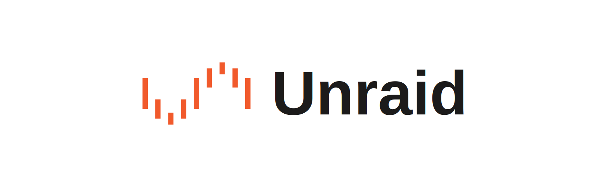
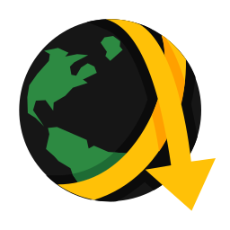
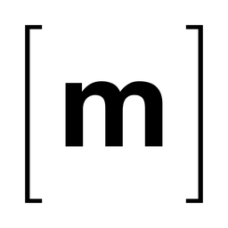
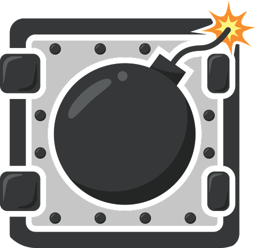
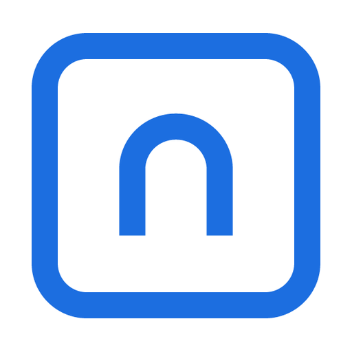
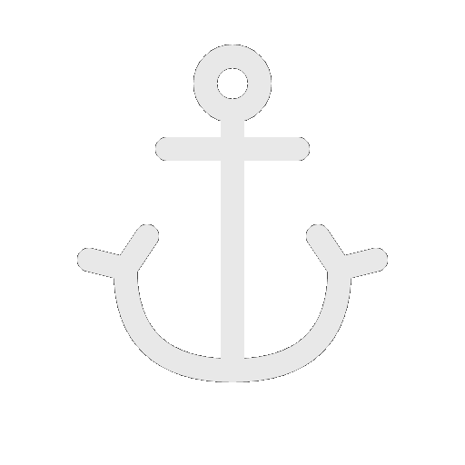
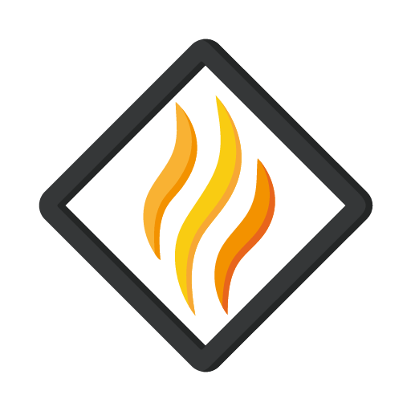

  

  &nbsp;
  &nbsp;
  &nbsp;
  &nbsp;
  

Unraid <b>Community Applications</b> templates for all of junkerderprovinz's containers — both <b>own-image</b> apps (Krusader, JDownloader, Matrix, featherdrop, BombVault) and <b>upstream-image</b> wrappers (OpenHands, Standard Notes, n8n), plus <b>plugins</b> (ShipLog, SmokeSignal). One repository, one CA feed; each app's image and full source live in its own per-app repository.

## Containers

*Own images built and published by junkerderprovinz — full docs live in each app's own repository.*

**Krusader** 
Twin-pane KDE file manager with a native dark theme, on a fast KasmVNC web desktop (Kate, krename, RAR).

 

**JDownloader** 
JDownloader 2 with a complete, sleek dark UI out of the box, on a KasmVNC web desktop.

 

**Matrix** 
All-in-one Matrix homeserver: Synapse + coturn + Element Web + Synapse-Admin in one container.

 

**featherdrop** 
Your own private WeTransfer — feather-light, login-free, end-to-end encrypted self-hosted file sharing. Drop a file, set an expiry, share a link.

 

**BombVault** 
Backup and full disaster recovery for Docker containers, VMs and the flash USB. One-click backup and automatic re-install, powered by restic.

 

## Templates

*Templates for third-party upstream images (no custom build) — full docs in each app's folder below.*

**OpenHands** 
Open-source AI software-development agent, pre-wired for a local Ollama model.

 

**Standard Notes Server** 
Self-hosted Standard Notes sync server (external MariaDB + Redis). Includes an optional **LocalStack** template for S3-compatible file storage.

 

**Standard Notes Web UI** 
The official Standard Notes web client.

 

**n8n** 
Workflow automation — connect 400+ apps and APIs. PostgreSQL by default, every option exposed in the template form.

 

## Plugins

*Unraid **plugins** (not containers) — listed on CA, installed from the Plugins tab via a `.plg` URL.*

**ShipLog** 
Read-only update advisor in Unraid's native Docker tab — a per-container changelog bubble: what changes between your running image and the newest, and how risky, before you press update. Remembers the running version (real "1.7 → 1.8"); optional Ollama summaries + Matrix alerts.

 

**SmokeSignal** 
Pre-reboot health check — a single **GO / CAUTION / NO-GO** verdict before you reboot, so you never reboot into a known landmine. Advisory only.

 

## Install

On Unraid: open **Apps** (Community Applications) and search for the app name — these templates are published from this repository.

To add a single template by hand, paste its raw `*.xml` URL into **Add Container → Template**, e.g.
`https://raw.githubusercontent.com/junkerderprovinz/unraid-apps/main/openhands/openhands.xml`

Containers link to their dedicated repository's README; template (upstream-image) apps keep their README in their folder here.

**Plugins** (ShipLog, SmokeSignal) are published from this repository too — CA lists them the same way as containers (a template with `<Plugin>True</Plugin>` + `<PluginURL>`), so search for them in **Apps**. You can also install a plugin directly from **Plugins → Install Plugin** with its raw `.plg` URL, e.g.
`https://raw.githubusercontent.com/junkerderprovinz/smokesignal/main/plugin/smokesignal.plg`
