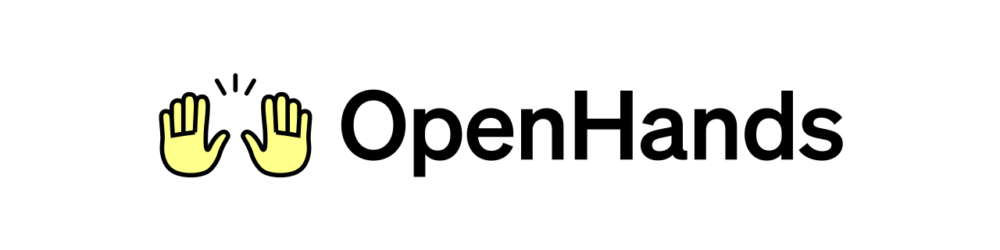
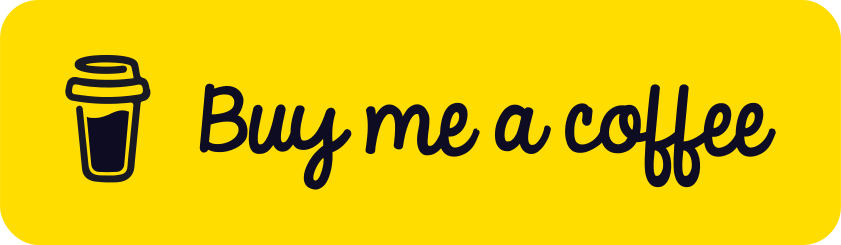
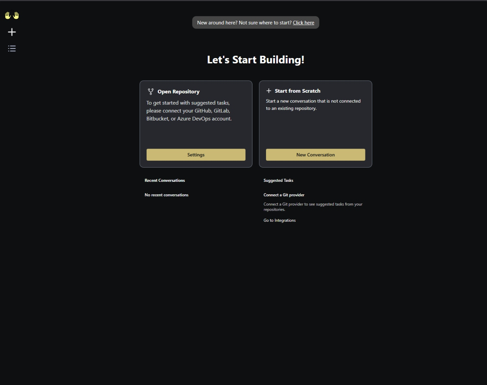
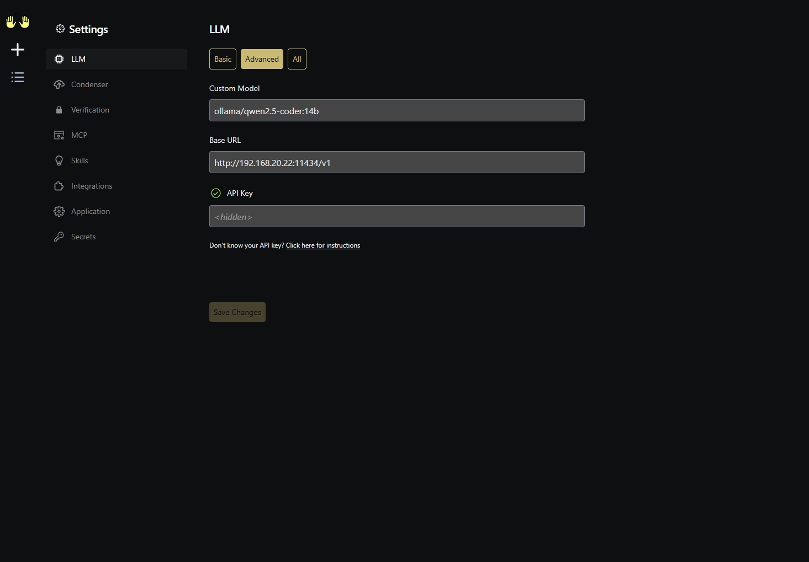
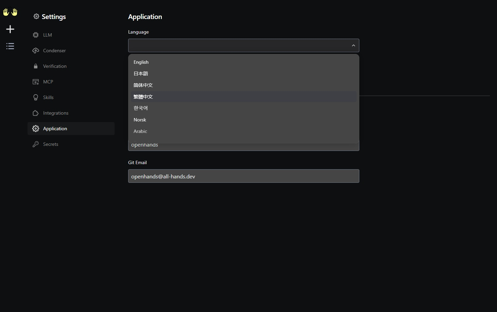

<h1 align="center">OpenHands for Unraid</h1>

<a href="https://github.com/OpenHands/OpenHands">
  
</a>

<p align="center">
  <a href="https://github.com/junkerderprovinz/unraid-docker-templates/actions/workflows/validate.yml"></a>&nbsp;
  <a href="https://github.com/OpenHands/OpenHands"></a>&nbsp;
  <a href="https://docker.openhands.dev/openhands/openhands"></a>&nbsp;
  <a href="https://ollama.com"></a>&nbsp;
  <a href="https://unraid.net"></a>&nbsp;
  <a href="../LICENSE"></a>
</p>

<p align="center">
A plug-and-play Unraid Community Applications template for <b>OpenHands</b> —
the open-source AI software-development agent. Pre-wired for <b>local
Ollama</b> with <code>qwen2.5-coder:14b</code>, Docker-socket sandboxing,
and <code>host.docker.internal</code> routing. Install from the Unraid
<b>Apps</b> tab, hit Apply, open the WebUI.
</p>

<br>

<p align="center">
  <a href="https://buymeacoffee.com/junkerderprovinz">
    
  </a>
</p>

<br>

## Table of Contents

1. [What is this?](#1-what-is-this)
2. [Features](#2-features)
3. [Quick Start on Unraid](#3-quick-start-on-unraid)
4. [Configuration](#4-configuration)
5. [GitHub Personal Access Token](#5-github-personal-access-token)
6. [Switching to OpenAI / Anthropic / other LLMs](#6-switching-to-openai--anthropic--other-llms)
7. [Updating](#7-updating)
8. [Troubleshooting](#8-troubleshooting)
9. [Security Notes](#9-security-notes)
10. [Screenshots](#10-screenshots)
11. [Contributing / License](#11-contributing--license)
12. [Support this project](#12-support-this-project)

<br>

## 1. What is this?

[OpenHands](https://github.com/OpenHands/OpenHands) (formerly *OpenDevin*) is
an open-source autonomous agent that can read, write, run and debug code,
browse the web, and execute shell commands in isolated sandbox containers.

This repository is **not a fork of OpenHands**. It only contains the Unraid
Community Applications metadata — an XML template, an icon and this README —
that tells Unraid how to deploy the upstream
[`docker.openhands.dev/openhands/openhands`](https://docker.openhands.dev/openhands/openhands)
image in a sensible default configuration for a typical Unraid box.

What this template gives you over a bare `docker run`:

- **Pre-configured for Ollama** — defaults point at `ollama/qwen2.5-coder:14b`
  via `host.docker.internal`, so a local Ollama install on the Unraid host
  works out of the box, no LLM gateway needed
- **Sandbox-ready** — the Unraid Docker socket is mounted, the right
  `SANDBOX_VOLUMES` and `--add-host` flags are pre-set, so OpenHands can
  actually spawn its execution containers
- **Persistent config** — `/.openhands` is mapped to `/mnt/user/appdata/openhands`,
  workspace files live in `/mnt/user/ai-workspace`
- **Embedded local embeddings** — `LLM_EMBEDDING_MODEL=local` avoids
  surprise API calls
- **Pinned to a known-good tag** — the template ships with the OpenHands
  image pinned to `:1.7`. New versions are surfaced as Renovate PRs so
  every bump is reviewed before users get it.

<br>

## 2. Features

- ✅ Pre-configured for **Ollama** with `qwen2.5-coder:14b` as the default
  coding model
- ✅ Talks to the host via `host.docker.internal` (the
  `--add-host host.docker.internal:host-gateway` flag is set automatically),
  so `http://host.docker.internal:11434` reaches Ollama on the Unraid host
  without bridging gymnastics
- ✅ Binds the Unraid Docker socket (`/var/run/docker.sock`) so OpenHands
  can spin up its **per-task sandbox containers**
- ✅ Workspace and sandbox volumes are kept in sync via `SANDBOX_VOLUMES`,
  so files the agent writes show up under `/mnt/user/ai-workspace` on the
  host
- ✅ Persistent agent state in `/mnt/user/appdata/openhands`
- ✅ Single template, no extra plugins or scripts required
- ✅ MIT-licensed wrapper — fork and adapt freely

<br>

## 3. Quick Start on Unraid

This is a plug-and-play Community Applications template. No SSH, no
config-file editing.

### Step 1 — Install from Apps

In the Unraid Web UI:

1. Go to the **Apps** tab.
2. Search for **`OpenHands`**.
3. Click **Install**.

> [!NOTE]
> If this template hasn't been accepted into the CA index yet, the search
> won't find it. In that case, jump to [§ Manual install](#manual-install-pre-ca-listing)
> below — a one-time `curl` puts the template into your user-templates
> folder, and it then shows up under *User templates* in the Add Container
> dialog.

### Step 2 — (Optional) make sure Ollama is reachable

Defaults assume you have **Ollama** running on the Unraid host (or in
another container reachable as `host.docker.internal:11434`) with the
`qwen2.5-coder:14b` model pulled:

```bash
ollama pull qwen2.5-coder:14b
```

If you want a different model or a remote LLM, see
[§ 6](#6-switching-to-openai--anthropic--other-llms).

### Step 3 — Apply the template

The CA install opens the template form with everything pre-filled. You
can leave every field at its default. The two you may want to tweak:

- **Workspace Directory** — defaults to `/mnt/user/ai-workspace`. This is
  where the agent reads and writes project files. Point it at an existing
  project share if you prefer. (If you change this, also adjust the
  **Sandbox Volumes** variable to match.)
- **LLM Model** — defaults to `ollama/qwen2.5-coder:14b`. Change to any
  [LiteLLM-style](https://docs.litellm.ai/docs/providers) model string.

Hit **Apply**. First start pulls the image (~3 GB) and warms up the
embedding model.

### Step 4 — Open the WebUI

`http://<unraid-ip>:3000/`

On first launch, OpenHands will ask you to confirm the LLM settings and
to provide a **GitHub Personal Access Token** if you want it to interact
with GitHub repos — see [§ 5](#5-github-personal-access-token).

### Manual install (pre-CA-listing)

Until this repo is accepted into the Community Applications index, you
can still load the template by hand. Run this once on the Unraid console
or via SSH:

```bash
mkdir -p /boot/config/plugins/dockerMan/templates-user && \
curl -fsSL -o /boot/config/plugins/dockerMan/templates-user/my-OpenHands.xml \
  https://raw.githubusercontent.com/junkerderprovinz/unraid-docker-templates/main/openhands/openhands.xml
```

Then in the Unraid Web UI: **Docker** → **Add Container** → in the
**Template** dropdown, pick **OpenHands** under *User templates*.

### Plain Docker (no Unraid)

```bash
docker run -d \
  --name openhands \
  --restart unless-stopped \
  --add-host host.docker.internal:host-gateway \
  -p 3000:3000 \
  -v /mnt/user/appdata/openhands:/.openhands \
  -v /mnt/user/ai-workspace:/workspace \
  -v /var/run/docker.sock:/var/run/docker.sock \
  -e SANDBOX_VOLUMES=/mnt/user/ai-workspace:/workspace:rw \
  -e LLM_API_KEY=ollama \
  -e LLM_MODEL=ollama/qwen2.5-coder:14b \
  -e LLM_BASE_URL=http://host.docker.internal:11434 \
  -e LLM_EMBEDDING_MODEL=local \
  docker.openhands.dev/openhands/openhands:1.7
```

<br>

## 4. Configuration

| Variable | Default | Description |
|---|---|---|
| `LLM_API_KEY` | `ollama` | API key for the LLM backend — any non-empty value works for Ollama |
| `LLM_MODEL` | `ollama/qwen2.5-coder:14b` | LiteLLM-style model string |
| `LLM_BASE_URL` | `http://host.docker.internal:11434` | Endpoint of the LLM. Default reaches Ollama on the Unraid host. Leave blank for hosted providers (OpenAI/Anthropic/…) |
| `LLM_EMBEDDING_MODEL` | `local` | Embedding model — `local` ships in the image |
| `SANDBOX_VOLUMES` | `/mnt/user/ai-workspace:/workspace:rw` | Host:container mount injected into every sandbox the agent spawns |

### Ports & Volumes

| Port | Purpose |  | Volume | Purpose |
|---|---|---|---|---|
| `3000` | OpenHands WebUI |  | `/.openhands` | Persistent agent state, settings, sessions |
|  |  |  | `/workspace` | Files the agent reads / writes |
|  |  |  | `/var/run/docker.sock` | Required to spawn sandbox containers |

### Extra runtime flags

The template applies:

```text
--add-host host.docker.internal:host-gateway
```

This lets the container reach services running on the Unraid host (Ollama,
your dev DB, etc.) via `http://host.docker.internal:<port>`.

### Image tag

The template ships pinned to `docker.openhands.dev/openhands/openhands:1.7`.
New OpenHands versions are picked up by [Renovate](renovate.json), which
opens a PR bumping the tag once a new release is available. After review
and merge, Unraid CA polls the repo within ~2 hours and offers the
update to users via the standard *Update Available* notification. Users
who want to override the tag manually can do so in the Unraid template's
*Repository* field (Advanced View).

<br>

## 5. GitHub Personal Access Token

OpenHands can clone repos, push commits, and open PRs on your behalf — but
**only if you give it a token**. The template does not ship a token (it
shouldn't — tokens are personal).

1. On GitHub: **Settings → Developer settings → Personal access tokens →
   Tokens (classic)** → **Generate new token**.
   - Scopes: `repo` (mandatory), `workflow` (optional, for editing
     Actions), `read:org` (optional).
2. Open the OpenHands WebUI at `http://<unraid-ip>:3000/`.
3. Click the gear icon → **Git → GitHub** → paste the token → **Save**.

The token is stored inside `/mnt/user/appdata/openhands` and never leaves
your box.

> [!WARNING]
> Treat the token like a password. Anyone with it can push to your repos.

<br>

## 6. Switching to OpenAI / Anthropic / other LLMs

OpenHands uses [LiteLLM](https://docs.litellm.ai), so the model string is
all that needs to change. Examples:

| Provider | `LLM_MODEL` | `LLM_API_KEY` |
|---|---|---|
| **Ollama** (default) | `ollama/qwen2.5-coder:14b` | `ollama` |
| **Ollama** — other model | `ollama/llama3.1:70b-instruct-q4_K_M` | `ollama` |
| **OpenAI** | `gpt-4o` | *your OpenAI key* |
| **Anthropic** | `anthropic/claude-3-5-sonnet-20241022` | *your Anthropic key* |
| **OpenRouter** | `openrouter/anthropic/claude-3.5-sonnet` | *your OpenRouter key* |
| **Mistral** | `mistral/mistral-large-latest` | *your Mistral key* |

Edit the Unraid template's `LLM_MODEL` and `LLM_API_KEY` fields, hit
**Apply**, done.

For Ollama on a **different host** (e.g. a GPU box on your LAN), change the
**LLM Base URL** field from the default `http://host.docker.internal:11434`
to `http://<gpu-host>:11434`. For a **hosted provider** (OpenAI, Anthropic,
…) clear that field — those use their own endpoints.

<br>

## 7. Updating

On Unraid: **Docker** tab → click the container → **Force Update**. Your
`/.openhands` data is untouched. If a new OpenHands version is released,
this repo's [Renovate](renovate.json) workflow opens a PR bumping the
`<Repository>` tag; once merged, a new tagged release ships and CA
re-pulls the template.

> [!TIP]
> Tag-pin to a specific minor (e.g. `:1.7`) — OpenHands ships often and
> the floating `:latest` tag has shipped breaking changes in the past.

<br>

## 8. Troubleshooting

<details>
<summary><b>WebUI loads but every task fails with "connection refused"</b></summary>

- Most likely the LLM endpoint isn't reachable. From inside the container:

  ```bash
  docker exec openhands curl -fsS http://host.docker.internal:11434/api/tags
  ```

  Should list your Ollama models. If it times out, Ollama isn't bound on
  the host's external interface — check `OLLAMA_HOST=0.0.0.0` in your
  Ollama service.
- Confirm `--add-host host.docker.internal:host-gateway` is actually
  applied: `docker inspect openhands | grep -A2 ExtraHosts`.
</details>

<details>
<summary><b>"Failed to create sandbox" / docker socket errors</b></summary>

- Check the socket mount: `docker inspect openhands | grep docker.sock`
- The host's `docker` group must allow access — on Unraid this is the
  default; on plain Linux you may need to run the container as a user
  in the `docker` group.
- If you're using `rootless` Docker, the socket path differs
  (`$XDG_RUNTIME_DIR/docker.sock`). Adjust the template accordingly.
</details>

<details>
<summary><b>Custom VLAN / ipvlan: "Sandbox server not running" or "Agent Server Failed to start properly"</b></summary>

This template defaults to the **Docker-socket sandbox**, where OpenHands
spawns a separate sandbox container and talks to it via
`host.docker.internal`. On a **bridge** network that works. On a **custom
VLAN / ipvlan** network it often doesn't — `host.docker.internal` routing
between containers breaks, and tasks fail with:

```text
Sandbox server not running: http://host.docker.internal:xxxxx
```

Two ways out:

- **Easiest — keep this container on `bridge`.** The agent's sandbox
  containers still spawn correctly; only the OpenHands container itself
  needs reliable `host.docker.internal` routing, which `bridge` gives you.
  Put a reverse proxy in front if you need it on the VLAN.
- **Process sandbox** — run the agent as an in-container process instead
  of a sibling container, avoiding cross-container networking entirely.
  Add these variables:

  ```text
  RUNTIME=process
  SANDBOX_RUNTIME=process
  ```

  > [!WARNING]
  > **Known bug in image `:1.7`.** Process sandbox currently fails with
  > `500: Agent Server Failed to start properly` even though the agent
  > server actually comes up — the readiness check wrongly probes
  > `host.docker.internal` instead of `127.0.0.1`. Tracked upstream as
  > [issue #14499](https://github.com/OpenHands/OpenHands/issues/14499),
  > fixed by [PR #14540](https://github.com/OpenHands/OpenHands/pull/14540)
  > (not yet released at time of writing). Until a fixed image ships,
  > prefer the `bridge` option above. Renovate will surface the fixed
  > release as an update PR automatically.

</details>

<details>
<summary><b>Agent writes files but I can't find them on the host</b></summary>

- They land in whatever path `SANDBOX_VOLUMES` maps. With the defaults,
  that's `/mnt/user/ai-workspace` on the host. The agent itself sees
  them as `/workspace`.
- If you changed **Workspace Directory** but not `SANDBOX_VOLUMES`, the
  two will be out of sync — the sandbox writes to a different host path.
  Keep them aligned.
</details>

<details>
<summary><b>Out of memory / OOM-killed during long tasks</b></summary>

- `qwen2.5-coder:14b` needs ~10 GB of RAM (or VRAM). Smaller alternatives:
  `qwen2.5-coder:7b`, `deepseek-coder-v2:16b-lite-instruct-q4_K_M`.
- Each sandbox container the agent spawns also consumes RAM — set a
  resource limit in the Unraid template's *Advanced View* if needed.

</details>

<details>
<summary><b>GitHub token not accepted</b></summary>

- Classic tokens must have at least `repo` scope. Fine-grained tokens
  must be granted access to the specific repos you want OpenHands to
  touch.
- Some self-hosted GitHub Enterprise instances need
  `GITHUB_API_URL=https://github.your-corp.com/api/v3` as an extra
  variable.

</details>

<br>

## 9. Security Notes

- **Docker socket = root on the host.** Mounting `/var/run/docker.sock`
  gives this container full control over your Unraid Docker daemon. Treat
  the OpenHands WebUI like a root shell — don't expose port 3000 to the
  internet without auth in front of it. A reverse proxy with
  authentication (e.g. NPM + Authelia / Authentik) is the right pattern.
- **The agent runs code.** That's the whole point. Sandbox containers
  reduce the blast radius but don't eliminate it — keep
  `/mnt/user/ai-workspace` on a share that doesn't contain anything you'd
  cry about losing.
- **Your LLM sees your code.** If you use a hosted LLM (OpenAI,
  Anthropic, etc.), every file the agent reads is sent to that provider.
  Ollama keeps everything on-box.

See [`SECURITY.md`](SECURITY.md) for the reporting policy.

<br>

## 10. Screenshots

<p align="center">
  
  <br><em>Home — 'Let's Start Building': open a repository or start from scratch.</em>
</p>

<p align="center">
  
  <br><em>Settings → LLM: Custom Model <code>ollama/qwen2.5-coder:14b</code> against a local Ollama at <code>http://&lt;LAN-IP&gt;:11434/v1</code> — no API key required.</em>
</p>

<p align="center">
  
  <br><em>Settings → Application: built-in language picker (English, 日本語, 中文, 한국어, Norsk, Arabic…).</em>
</p>

<br>

## 11. Contributing / License

Pull requests welcome. Issues:
<https://github.com/junkerderprovinz/unraid-docker-templates/issues>.

CI runs XML validation, an Unraid CA sanity check, markdown + YAML lint
and a link check on every PR — see [`.github/workflows/ci.yml`](.github/workflows/ci.yml).

**Licensing — dual:**

- This **wrapper repository** (Unraid template, README, banner/icon
  artwork) is licensed under the [MIT License](LICENSE).
- **OpenHands itself** is developed by the OpenHands community and
  retains its upstream license — see
  <https://github.com/OpenHands/OpenHands>. When you run, redistribute or
  rebuild the resulting container image, you must comply with **all**
  upstream licenses, not only with this wrapper's MIT license.

### Credits

- [**OpenHands**](https://github.com/OpenHands/OpenHands) — the team and
  community building the agent
- [**Ollama**](https://ollama.com) — for making local LLMs painless
- [**LiteLLM**](https://litellm.ai) — for unifying every LLM API on the
  planet
- [**Unraid Community Applications**](https://forums.unraid.net/forum/38-community-applications/)
  — for being the best app store in self-hosting

<br>

## 12. Support this project

If this template saves you a setup hassle or a debug night, consider buying me a coffee:

<p align="center">
  <a href="https://buymeacoffee.com/junkerderprovinz">
    
  </a>
</p>
