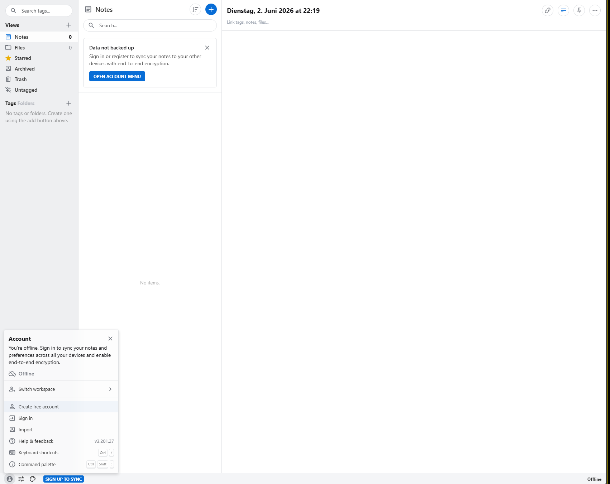
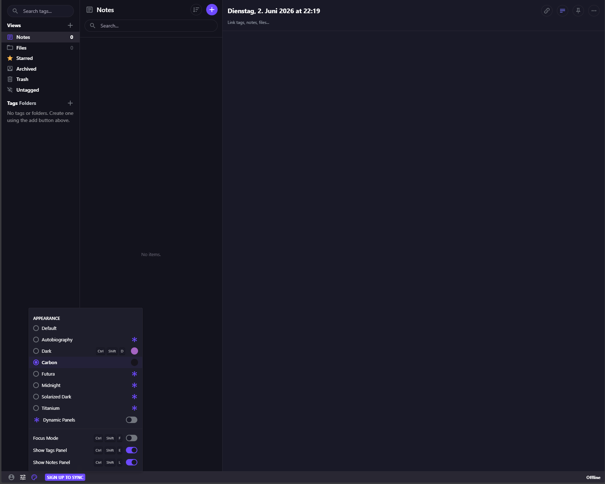

<h1 align="center">Standard Notes WebUI for Unraid</h1>

<a href="https://standardnotes.com">
  
</a>

<p align="center">
  <a href="https://github.com/junkerderprovinz/unraid-docker-templates/actions/workflows/validate.yml"></a>&nbsp;
  <a href="https://hub.docker.com/r/standardnotes/web"></a>&nbsp;
  <a href="https://standardnotes.com"></a>&nbsp;
  <a href="../standardnotes-server/"></a>&nbsp;
  <a href="#3-quick-start-on-unraid"></a>&nbsp;
  <a href="../LICENSE"></a>
</p>

<p align="center">
A clean, opinionated <b>Unraid Community Template</b> for the official
<a href="https://hub.docker.com/r/standardnotes/web"><code>standardnotes/web</code></a>
browser client. Runs the static web app on Unraid in a single container,
ready to be reverse-proxied to <code>app.standardnotes.mydomain.tld</code>
and pointed at your self-hosted Standard Notes backend.
</p>

<p align="center">
<i>Unofficial community wrapper. Not affiliated with or supported by Standard Notes.</i>
</p>

<br>

<p align="center">
  <a href="https://buymeacoffee.com/junkerderprovinz">
    
  </a>
</p>

<br>

## Table of Contents

1. [What is this?](#1-what-is-this)
2. [What it does NOT do](#2-what-it-does-not-do)
3. [Quick Start on Unraid](#3-quick-start-on-unraid)
4. [Reverse Proxy](#4-reverse-proxy)
5. [Configuring the Sync Server](#5-configuring-the-sync-server)
6. [Updating](#6-updating)
7. [Troubleshooting](#7-troubleshooting)
8. [Screenshots](#8-screenshots)
9. [Publishing to Community Applications](#9-publishing-to-community-applications)
10. [Contributing / License](#10-contributing--license)
11. [Support this project](#11-support-this-project)

<br>

## 1. What is this?

This repository ships a single **Unraid Community Application template**
for the official
[`standardnotes/web`](https://hub.docker.com/r/standardnotes/web) Docker
image — the **browser client** for Standard Notes.

It is the companion of the backend template repo
[`junkerderprovinz/standardnotes-server`](../standardnotes-server/)
(container name `StandardNotes-Server`). Together they let you run a fully
self-hosted Standard Notes stack on Unraid:

```
Browser ──HTTPS──►  app.standardnotes.mydomain.tld  ──►  StandardNotes-WebUI  (this template, web client)
                                                              │
                                                              ▼  (Custom Sync Server set in the web UI)
            HTTPS──►  standardnotesserver.mydomain.tld     ──►  StandardNotes-Server  (companion repo, backend)
```

What you get:

- **One container, one template.** Container name `StandardNotes-WebUI`, image
  `standardnotes/web:latest`, host port `3001` → container port `80`.
- **Default port `3001`** chosen so the WebUI does not collide with the
  backend's `:3000` API gateway on the same Unraid host.
- **Reverse-proxy ready.** Pair with Nginx Proxy Manager / SWAG / Traefik
  to terminate TLS at e.g. `app.standardnotes.mydomain.tld`.
- **Minimal env surface.** The official upstream Docker docs only document
  `docker run -d -p 3000:80 standardnotes/web` — no sync-server env var
  is exposed, so this template intentionally does not invent one. Sync
  server is configured **at runtime in the browser**, see § 5.

<br>

## 2. What it does NOT do

- **Does not host a sync server.** This is *only* the browser UI. You
  still need a running Standard Notes backend — the companion repo
  [`standardnotes-server`](../standardnotes-server/)
  ships an Unraid template for `standardnotes/server`.
- **Does not unlock paid / subscription Standard Notes features.**
  Subscription-only client features (extended editors, advanced themes,
  Files quota, Listed, etc.) are gated by Standard Notes' own licensing
  / subscription checks, which live in the upstream client itself. This
  template deploys the upstream `standardnotes/web` image as-is and does
  **not** patch, bypass, or otherwise modify those checks. Self-hosting
  gives you data ownership and a free Sync server; it does not turn a
  free account into a paid one.
- **Does not auto-configure the sync server.** The upstream image does
  not document an env var for the default sync URL, so this template
  does not set one. Users enter their backend URL via the web app's
  *Advanced options → Custom Sync Server* on first launch — see § 5.

<br>

## 3. Quick Start on Unraid

### Step 0 — Pre-flight

You will need:

- An Unraid server with **Community Applications** installed.
- A running Standard Notes **backend** reachable over HTTPS at e.g.
  `https://standardnotesserver.mydomain.tld` (use the
  [`standardnotes-server`](../standardnotes-server/)
  template).
- A reverse proxy (NPM, SWAG, Traefik, Caddy) for the web app's own
  hostname, e.g. `app.standardnotes.mydomain.tld`.

### Step 1 — Install the template

Pull the template into Unraid's user-template folder:

```bash
mkdir -p /boot/config/plugins/dockerMan/templates-user

curl -fsSL -o /boot/config/plugins/dockerMan/templates-user/my-StandardNotes-WebUI.xml \
  https://raw.githubusercontent.com/junkerderprovinz/unraid-docker-templates/main/standardnotes-webui/standardnotes-webui.xml
```

> 📌 Templates dropped into
> `/boot/config/plugins/dockerMan/templates-user/` appear under
> **Docker → Add Container → Template → User templates** without
> restarting Docker.

### Step 2 — Start the container

In the Unraid Web UI: **Docker** → **Add Container** → in the
**Template** dropdown, pick **StandardNotes-WebUI** under *User templates*.

The only field is the **WebUI Port** (host port — default `3001`).
Hit **Apply**. The container starts in seconds; visit
`http://<unraid-ip>:3001/` to confirm the web app loads.

### Step 3 — Reverse-proxy and connect to your backend

Set up a reverse-proxy host for the web app (see § 4), then open the web
app at your public URL and configure the sync server (§ 5).

<br>

## 4. Reverse Proxy

Terminate TLS at your reverse proxy. The container itself serves plain
HTTP on port 80 inside, exposed as host port `3001` by default.

> ⚠️ **HTTPS is not optional for the web app.** Standard Notes uses the
> browser's WebCrypto API (`window.crypto.subtle`) during sign-up and
> sign-in. Browsers only expose `crypto.subtle` on **secure contexts**
> (HTTPS, or the `localhost` exception). Opening the web app over
> `http://<unraid-ip>:3001/` will fail at account creation with
> `crypto.subtle is undefined`. Always reach the web app through the
> HTTPS reverse-proxy hostname (e.g. `https://app.standardnotes.mydomain.tld/`).

### Nginx Proxy Manager (recommended on Unraid)

In the NPM UI, **Hosts → Proxy Hosts → Add Proxy Host**:

| | Value |
|---|---|
| **Domain Names** | `app.standardnotes.mydomain.tld` |
| **Scheme** | `http` |
| **Forward Hostname / IP** | `192.168.x.x` *(StandardNotes-WebUI container IP, or the Unraid host IP)* |
| **Forward Port** | `80` if forwarding to the **container IP** (custom IP on `br0` / `macvlan`); `3001` (or your chosen host port) if forwarding to the **Unraid host IP** (bridge / host-port mode) |
| **Block Common Exploits** | on |
| **Websockets Support** | on |
| **SSL** | request a Let's Encrypt cert, **Force SSL** on, **HTTP/2 Support** on, **HSTS** on once the cert renews automatically. |

### Generic SWAG / nginx snippet

```nginx
server {
    listen 443 ssl http2;
    server_name app.standardnotes.mydomain.tld;

    include /config/nginx/ssl.conf;

    location / {
        include /config/nginx/proxy.conf;
        resolver 127.0.0.11 valid=30s;
        set $upstream_app 192.168.x.x;
        set $upstream_port 3001;
        set $upstream_proto http;
        proxy_pass $upstream_proto://$upstream_app:$upstream_port;
        proxy_set_header Host $host;
        proxy_set_header X-Forwarded-For $proxy_add_x_forwarded_for;
        proxy_set_header X-Forwarded-Proto $scheme;
    }
}
```

> 💡 The web app's hostname (`app.standardnotes.mydomain.tld`) and the
> backend's hostname (`standardnotesserver.mydomain.tld`) are **different
> proxy hosts**. Don't try to share one — the web app makes
> cross-origin API calls to the backend, so they need their own TLS
> certs and their own NPM / SWAG entries.

<br>

## 5. Configuring the Sync Server

The official `standardnotes/web` image does **not** expose an env var
for the default sync server. The upstream Docker docs only show:

```bash
docker run -d -p 3000:80 standardnotes/web
```

Sync server is configured per-user, **at runtime in the browser**:

1. Open the web app at `https://app.standardnotes.mydomain.tld/`.
2. On the sign-in / sign-up screen, click **Advanced options**.
3. Set **Sync Server** to your backend's public URL, e.g.
   `https://standardnotesserver.mydomain.tld`.
4. Sign in or create an account against your self-hosted backend.

The browser remembers the custom sync URL per origin — every user of
your web app instance enters it once.

> ⚠️ **Do not invent env vars.** If you find a third-party guide that
> mentions e.g. `SYNC_SERVER_URL` or `DEFAULT_SYNC_SERVER` for
> `standardnotes/web`, treat it skeptically — the official Docker docs
> do not list any such variable, and adding unsupported env vars to
> this template can silently produce a web client that points at the
> public Standard Notes sync server instead of your backend. Update
> this template only if `https://hub.docker.com/r/standardnotes/web`
> documents the variable.

<br>

## 6. Updating

```bash
docker pull standardnotes/web:latest
docker stop StandardNotes-WebUI && docker rm StandardNotes-WebUI
# re-create with the same template / docker run args
```

On Unraid: **Docker** tab → click the container → **Force Update**.
The web app has no on-disk state, so updates are usually instant.

Pin a known-good tag in the template's *Repository* field if `latest`
ever regresses, e.g. `standardnotes/web:3.x.y`.

<br>

## 7. Troubleshooting

<details>
<summary><b>Account creation fails with <code>can't access property "digest", crypto.subtle is undefined</code></b></summary>

- The web app is being opened over a **non-secure origin**, typically
  `http://<unraid-ip>:3001/` or another plain-HTTP URL. Browsers only
  expose `window.crypto.subtle` (WebCrypto) on **secure contexts** —
  HTTPS, or the `localhost` / `127.0.0.1` exceptions. Standard Notes
  uses `crypto.subtle.digest` during sign-up / sign-in to derive the
  account key, so without it, account creation throws this error.
- **Fix:** access the web app through your HTTPS reverse proxy, e.g.
  `https://app.standardnotes.mydomain.tld/`, not `http://<ip>:3001/`.
  See § 4 for the NPM / SWAG setup.
- **NPM forwarding target:**
  - With a **custom container IP** (the StandardNotes-WebUI container has its
    own LAN IP, e.g. on `br0`): forward to that container IP, port
    `80` (the container's internal port). The host port doesn't apply.
  - With **bridge / host-port mode**: forward to your Unraid host IP
    and the host port you set on the template (default `3001`).
- The **backend sync server** stays on its own hostname, e.g.
  `https://standardnotesserver.mydomain.tld`, and is entered separately
  under *Advanced options → Custom Sync Server* (see § 5).
- Quick smoke test: open the browser devtools console at the HTTPS
  URL and run `window.isSecureContext` — it must return `true`.
</details>

<details>
<summary><b>Web app loads but "Unable to reach server"</b></summary>

- The web app is talking to the **sync server**, not to itself. Verify
  the URL you entered under *Advanced options → Sync Server* is your
  HTTPS backend URL (e.g. `https://standardnotesserver.mydomain.tld`),
  reachable from your browser.
- Run `curl -fsI https://standardnotesserver.mydomain.tld/healthcheck` from
  any host. A non-200 here is a backend / reverse-proxy issue, not a
  web-client issue.
</details>

<details>
<summary><b>Mixed-content blocks in browser console</b></summary>

- The web app must be served over HTTPS, **and** the backend must be
  served over HTTPS. A plain `http://` Sync Server URL will be blocked
  by the browser when the web app is served over HTTPS.
</details>

<details>
<summary><b>"Failed to fetch" / CORS errors</b></summary>

- The web app makes cross-origin API calls to the backend. Ensure the
  backend's reverse-proxy host is up and the backend is configured with
  `COOKIE_DOMAIN` matching its own public hostname (see the
  [`standardnotes-server`](../standardnotes-server/)
  README §0 / §6).
</details>

<details>
<summary><b>Port 3001 already in use</b></summary>

- Pick another host port in the template — anything except 3000 (used
  by the backend's API gateway) and 3125 (used by the backend's files
  server) is fine. 8080, 8081, 4321 are common alternatives.
</details>

<details>
<summary><b>I want paid features by self-hosting</b></summary>

- Self-hosting does not unlock paid Standard Notes features. See § 2.
</details>

<br>

## 8. Screenshots

<p align="center">
  
  <br><em>Notes view served by the self-hosted web client (default light theme) — the Account menu shows the offline state with “Create free account” / “Sign in”.</em>
</p>

<p align="center">
  
  <br><em>Appearance menu with the bundled themes (Carbon dark selected) — Default, Autobiography, Dark, Carbon, Futura, Midnight, Solarized Dark, Titanium.</em>
</p>

<br>

## 9. Publishing to Community Applications

This repo publishes **one** Unraid CA template:

| Template | Container | Image |
|---|---|---|
| `StandardNotes-WebUI` | `StandardNotes-WebUI` | `standardnotes/web:latest` |

The companion backend repo
[`standardnotes-server`](../standardnotes-server/)
publishes the **two** server-side templates (`StandardNotes-Server`
plus the Standard-Notes-specific `StandardNotes-LocalStack`
companion). One CA submission per repo — not per template.

Before submitting this repo at <https://ca.unraid.net/submit>:

- Repo is **public** and the **Build** / **Lint** workflows are green
  on `main`.
- `LICENSE` (MIT, OSI-approved) is at the repo root.
- `ca_profile.xml` is at the repo root with a non-empty `<Profile>`,
  and `<Icon>` / `<WebPage>` / `<Repo>` URLs that resolve.
- `templates/standardnotes-webui.xml` parses (`xmllint --noout`),
  pulls a real image, and every raw GitHub URL in it (`<TemplateURL>`,
  `<Icon>`) returns 200.
- A shared Unraid forum **support thread** for these templates is set in
  the template's `<Support>` tag:
  <https://forums.unraid.net/topic/198811-support-junkerderprovinz-unraid-docker-templates/>.

```bash
xmllint --noout templates/standardnotes-webui.xml ca_profile.xml

for url in \
  https://raw.githubusercontent.com/junkerderprovinz/unraid-docker-templates/main/standardnotes-webui/standardnotes-webui.xml \
  https://raw.githubusercontent.com/junkerderprovinz/unraid-docker-templates/main/ca_profile.xml \
  assets/icon.png
do
  echo "$url"; curl -fsI "$url" | head -n 1
done
```

A `404` here is the most common reason a CA submission is rejected —
fix before submitting.

<br>

## 10. Contributing / License

Pull requests welcome. Issues:
<https://github.com/junkerderprovinz/unraid-docker-templates/issues>.

**License:** [MIT](LICENSE).

This wrapper repository (Unraid template, README, banner / icon artwork)
is MIT-licensed. The upstream `standardnotes/web` image retains its own
license (AGPL-3.0) — comply with it when running or redistributing the
web client.

```bash
# Validate locally
python3 -c "import xml.etree.ElementTree as ET; \
  [ET.parse(f) for f in ['templates/standardnotes-webui.xml', \
                          'assets/banner.svg', \
                          'assets/icon.svg']]"
```

### Credits

- [**Standard Notes**](https://standardnotes.com) — the actual project &
  upstream `standardnotes/web` Docker image
- [**`standardnotes-server`**](../standardnotes-server/)
  — companion Unraid template for the backend
- [**Unraid Community Applications**](https://forums.unraid.net/topic/38582-plug-in-community-applications/)
  — the distribution channel

<br>

## 11. Support this project

If this template saves you a setup hassle or a debug night, consider buying me a coffee:

<p align="center">
  <a href="https://buymeacoffee.com/junkerderprovinz">
    
  </a>
</p>
